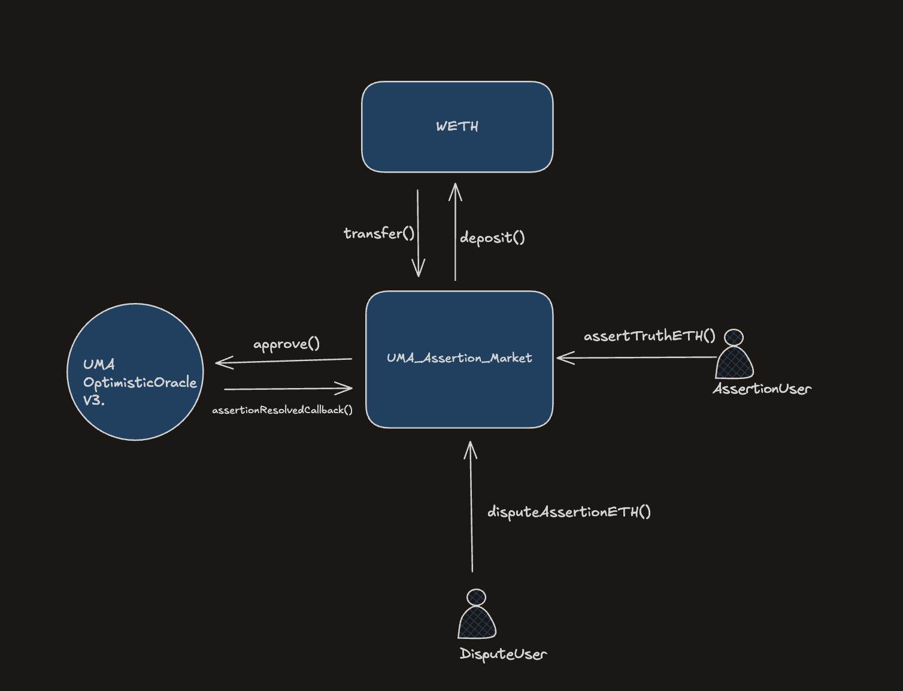

# EthAssert -  Native ETH Assertion Market

## Overview

EthAssert is a native ETH assertion market built on UMA Optimistic Oracle v3, providing a gas-optimized, production-grade interface for posting, disputing, and settling claims with ETH-backed bonds.

This project implements a **production-grade, minimal, gas-optimized integration with UMA Optimistic Oracle v3 (OOv3)**.


The contract provides a native ETH–first user experience, while internally conforming to UMA’s requirement that all bonds are posted in ERC20 tokens. ETH is wrapped into WETH internally and used as the oracle bond currency.

The implementation focuses on:

- Correct optimistic assertion flow

- Real dispute handling (no mocks)

- Secure oracle callbacks

- Strict settlement finality

- Gas efficiency and minimal state

---

## High-Level Flow



---

## Architecture & Design Decisions

### Native ETH → WETH Translation

- UMA OO v3 **only accepts ERC20 tokens** for bonds  
- This contract accepts **native ETH** for better UX  

Internally:

- Required bond is queried via `getMinimumBond(WETH)`
- ETH is wrapped into **canonical Sepolia WETH**
- WETH is approved and sent to UMA

This preserves UMA’s economic guarantees while offering a clean ETH-first interface.

---

# UMA Optimistic Oracle Flow (As Implemented)

## 1. Assertion Creation

**Function:** `assertTruthETH`

**Flow:**
1. User submits native ETH (`msg.value`) along with an assertion claim.
2. The contract queries UMA for the minimum bond required for WETH:

```solidity
oracle.getMinimumBond(address(weth))
```

3. The bond portion of ETH is wrapped into WETH.
4. WETH is approved and supplied to UMA's `assertTruth`.
5. Remaining ETH is recorded as the market stake.
6. Assertion metadata is stored locally, keyed by `assertionId`.

**Key Properties:**
* Bond amount is dynamic, not hardcoded.
* Assertion ID is generated by UMA (hash of claim + parameters).
* Contract registers itself as the callback recipient.

## 2. Optimistic Period (Liveness)

* Once submitted, the assertion enters a liveness window.
* During this period:
   * Anyone may dispute.
   * No funds are released.
* Liveness enforcement is delegated entirely to UMA.

This preserves protocol correctness and avoids duplicating oracle logic.

## 3. Dispute Mechanics

**Function:** `disputeAssertionETH`

**Flow:**
1. Any address may dispute during the liveness window.
2. The disputer must supply exactly the same bond amount (in ETH).
3. ETH is wrapped into WETH and forwarded to UMA.
4. UMA escalates the assertion to the DVM if disputed.

**Why exact bond enforcement matters:**
* Prevents partial or malformed disputes.
* Mirrors UMA's economic guarantees.

## 4. Oracle Resolution Callback

**Function:** `assertionResolvedCallback`

* Callable only by UMA.
* Executes exactly once per assertion.
* Updates resolution state (`resolved`, `truthful`).
* No funds move here.

This strictly follows the Checks-Effects-Interactions (CEI) pattern and ensures oracle finality before settlement.

## 5. Settlement

**Function:** `settle`

* Callable only after oracle resolution.
* Prevents double settlement.
* Releases ETH stake:
   * To the asserter if the assertion is true
   * To the disputer if false

Bond settlement is handled natively by UMA.

## Edge Case Handling (Mandatory)

### 1. Last-Second Disputes

* Liveness and expiry are enforced by UMA:

```solidity
assertion.expirationTime > block.timestamp
```

* Disputes submitted at the final second are valid.
* Late disputes are rejected by the oracle.

**Design choice:** Delegate timing enforcement to UMA.

### 2. Concurrency (Multiple Assertions per User)

* Assertions are stored in a mapping keyed by `assertionId`.
* No per-user global state.
* Unlimited concurrent assertions are supported.

```solidity
mapping(bytes32 => Assertion) public assertions;
```

### 3. Invalid or Malicious Callbacks

Protected by:

```solidity
if (msg.sender != address(oracle)) revert NotOracle();
if (a.asserter == address(0)) revert UnknownAssertion();
if (a.resolved) revert AlreadyResolved();
```

Additionally:
* `assertionDisputedCallback` is implemented and does not revert, as required by UMA.

### 4. Balance Changes During Assertion Lifetime

* ETH stake is tracked per assertion, not via global balance.
* Settlement uses recorded stake only.
* Unrelated ETH transfers or withdrawals do not affect payouts.

### 5. Re-Submission / Double Settlement

* Assertions can be resolved only once.
* Settlements are guarded by a `settled` flag.
* Replay attempts revert.

## Gas Optimization Decisions

### Storage Optimization

* Compact `Assertion` struct using packed types:

```solidity
uint96 bond;
uint96 stake;
bool resolved;
bool truthful;
bool settled;
```

* No arrays or iteration.
* O(1) access for all operations.

### Logic Optimization

* No redundant state variables.
* No manual liveness tracking.
* UMA handles bond accounting and oracle resolution.
* Dynamic bond fetching avoids over-collateralization.

### Security & Efficiency Tradeoffs

* Uses `ReentrancyGuard` only where ETH transfers occur.
* CEI enforced in callbacks and settlement.
* No unnecessary modifiers or ownership checks on hot paths.

## Notes on UMA Testnet Behavior

On Sepolia:
* Disputed assertions are escalated to the UMA DVM.
* Resolution timing depends on governance participation.
* Callbacks may be delayed or never fire.

This behavior is expected on testnet and is not a contract issue.

On mainnet, oracle resolution and callbacks are reliable.


## Script and Usage:

### Build
```solidity
forge build
```

### Test
```solidity
forge test
```

### Format
```solidity
forge fmt
```   
### Deployment
```solidity
forge script script/Deploy.s.sol --rpc-url $SEPOLIA_RPC_URL --broadcast --verify --etherscan-api-key $ETHERSCAN_API_KEY
```
### Assert Script
```solidity
forge script script/Assert.s.sol --rpc-url $SEPOLIA_RPC_URL --broadcast
```

## Successful Assert Tx

https://sepolia.etherscan.io/tx/0x871e061866e3963fcd50606b65074eb1af3a11adee72ae5bf5be2d83c7a1c713#eventlog


### Dispute Script
```solidity
forge script script/Dispute.s.sol --rpc-url $SEPOLIA_RPC_URL --broadcast
```

## Successful Dispute Tx

https://sepolia.etherscan.io/tx/0x3daf2d3a8f9b33e0918149b06149f3226cef8ebefc24d456f8749e0bbf7317c5#eventlog


## Deployment Address

**Verified on Sepolia:** https://sepolia.etherscan.io/address/0xE524748488cC11b9AA44bFbf59e5566582D3B525#code


## Testing Coverage
```solidity
UmaAssertionMarket.sol
  Statements: 98.11%
  Branches:   96.67%
  Functions:  52.63%
  Lines:     100.00%
```


